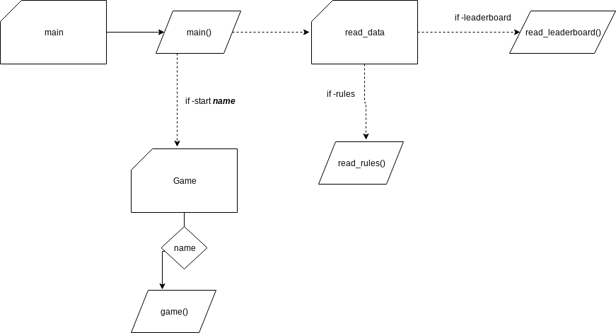
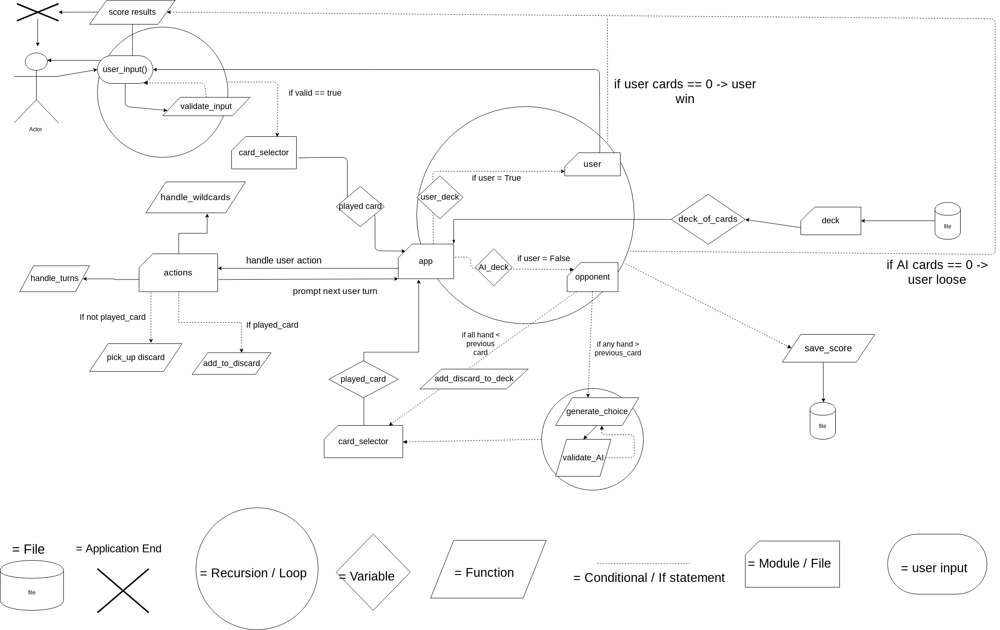

# Software Plan - Idiot card game
---

#### By: ***Joseph Abouharb***
## Contents:
1. Introduction 
   1. Purpose and Scope
2. Software Overview
   1. Features
   2. User Interaction and Experience
   3. Control Flow Diagram
3. Planning and Implementation
   1. Checklist and deadlines 
## Introduction
### 1. Purpose and Scope

Game Developer X has commissioned our team to write and develop back-end scripts to handle some tasks for their game based on the popular card game called Idiot. The game's rules are as follows:

> "Each player is handed 9 cards. 6 are placed on the table 3 of them side up. These cards can only be played once the cards in their hand are exhausted. The other 3 are the hand of each player. Players must play a card, which must be  higher than the previous play, otherwise they must pick up the discard pile. The cards 2, 7, 10 are wildcards that can reset values, reverse the play and bomb the discard pile respectively. Players must pick up a card from the deck once they play a card down. Whoever finishes the game with no cards left to play wins"

They expect this game to be popular on mobile and to target casual audiences, with an accessible UI/UX that allows the user to easily select their cards and display useful feedback about the game. A Python terminal application that accepts user input and returns helpful messages/ output in order to provide a simple and intuitive game experience for users. This application could also be run with certain arguments to handle easy data retrieval (scoreboards, game rules, etc) and other tasks. At the moment, the application should work with at least one AI. The application expects the AI to handle to rules of the game correctly, and provide some challenge to the end user. Also, The game should ensure that decks shuffle correctly and all 52 cards of a standard deck is played. They also expect the application to save and format the game results in a file and retrieve them for display. The developer is currently researching the viability of scripting AI and automating tasks using python for game development. If successful, this developer may choose to use it as a part of their game engine to handle these tasks. The developer hopes that the simple fun of the game with a well designed user experience can cater to some casual audiences. The success of this project is determined by player feedback and increased popularity of the game.

The expected deadline for completing this application is within 2 weeks and all basic requirements must be met. 


## Software Overview
### 1. Features \ User Stories

#### 1. Card Shuffling

> "As a user I expect the game's starting cards be different each play"

Randomisation is significant in developing video games in order to ensure better interactivity and challenge. By importing python's random library we can simulate cards shuffling and deck creation easily. This will ensure that each play is relatively unique and fun for players. By using lists (or sets) with random's shuffle method we can rearrange the order of items in lists. We can also use random's sample method to hand out decks to each card, ensuring that they are removed from the deck. Consider using loops in order to iterate through the deck as well as yields (generator methods), which ensures cards are handed when needed. 

#### 2. Game Scores

> "As a user I want to retrieve game data such as total score and the game rules"

A method of storing structured data is needed to store constants like card names, rules, menus as well as user data like scores. JSON is handy for storing and retrieving such data. Python has the JSON to retrieve and store this data using json.load() and json.dump() respectively. python usually handles these variables as dict types, so key values are needed to retrieve specific objects. Error handling with try/except is important to consider when using these functions in order to check the integrity of these files and whether they exist. The Path and os library have functions that provide checks to check whether certain data exists. 

#### 3. AI rule handling

> "As a user I expect the AI to handle the games rules accurately, and behave differently on each turn"

A way to simulate a computer/ AI user is required for this game to be played. creating variables which keep both the user and the AI's hand are needed, as well as their own functions that perform methods on them. These methods should perform actions like play_from_hand pick_discard pick_from_deck etc. The AI requires the Random library in order to simulate random behaviour. If statements should be used to read their deck and appropriately play the right card - play the next highest card (from the previously played) from their hand and pick from the deck as well as detect if the wildcards are played. for loop? statements should also be used to automate both the AI and the user to pick up the discard pile when they have no winning hand.  


### 2. User Interaction

In order to execute the app the user must provide either these as command line arguments:

-  \--start or -s to play game
- \--leaderboard to return user's win resuls
- -r and -h to provide user with rules and help help prompt respectively
- if no arguments or an invalid one is entered automatically display the -h menu

The game's UI is designed to be user friendly, only expecting user inputs and providing feedback during play. During play, user's will be displayed their current hand and their table pile like so:

> ​						`# ##### #`
>
> ​						`## 5oH ##`    This is the previously played deck
>
> ​						`# ##### #`
>
> 
>
> `on table:`
>
> `visible: card 4	card 5	card 6`
>
> `hidden: ####	#####	#####`
>
> 
>
> `Your Hand: 1) 2oC`				`2) 7oS`			`3) KoD`
>
> `Select from 1-3 _`

Users must select from 1-3 in order to play correctly. Input validation will be handled in a function like this:

```
if user_input.isdigit() is False:`

	`return None`

`try:`

	`val = int(user_input)`

`except ValueError:`

	`return None`

`if val >= len(user_hand):`

	`return None`

`if val < previous_played_card:`

	return None))`

`return val
```

if their hand has no hand that is higher than the previously played card then display:

> `You have no higher card! you picked up the discard pile! :P `
>
> `on table:`
>
> `visible: card 4	card 5	card 6`
>
> `hidden: ####	#####	#####`
>
> 
>
> `Your Hand: 1) 2oC`				`2) 7oS`			`3) KoD`    ` 4) AoC`			`5) 9oS`		`6) QoD`      ` 7) 9oC`				`8) 2oS`			`9) JoC` ....
>
> `Select from 1-9 _`

### 3. Planning and implementation

#### 3.1 Checklist

| Idea                                     | Queued for Implementation    | In Progress    | Testing        | Completed   |
| ---------------------------------------- | ---------------------------- | -------------- | -------------- | ----------- |
| Shuffling Deck - 13/06                   | Yes - 13/06 deadline: 20/06  | Passed - 15/06 | Passed - 16/06 | Yes - 19/06 |
| User Input - 13/06                       | Yes - 21/06 deadline: 20/06  | Passed - 19/06 | Passed - 20/06 | Yes - 21/06 |
| Input validation - 13/06                 | Yes - 14/06 deadline: 21/06  | Passed - 15/06 | Passed - 20/06 | Yes - 21/06 |
| Prompt user turns - 13/06                | Yes -  21/06 deadline: 21/06 | Passed - 21/06 | Passed - 28/06 | Yes - 29/06 |
| Rules / Wildcards 13/06                  | Yes - 21/06 deadline: 28/06  | Passed - 21/06 | Passed - 1/07  | Yes - 4/06  |
| AI - 13/06                               | Yes - 25/06 deadline: 01/07  | Passed - 25/06 | Passed - 03/07 | Yes - 04/07 |
| Score saving and retrieving - 13/06      | Yes - 03/07 deadline: 04/07  | Passed - 04/07 | Passed - 04/07 | Yes - 04/07 |
| Command line arguments- 13/06            | Yes - 02/06 deadline: 04/07  | Passed - 04/07 | Passed - 04/07 | Yes - 04/07 |
| Adding multiple cards to discard - 29/06 | Yes - 04/06 deadline: 04/07  | Passed - 04/07 | Passed - 04/07 | Yes - 05/07 |
| 4 of a kind Bomb - 29/06                 | Yes - 04/06 deadline: 05/07  | Passed - 04/07 | passed - 05/07 | Yes - 06/07 |
| Changing deck at start 29/06             | No - Exceeded Deadline :(    |                |                |             |

#### 3.2 Appllication Flow Diagrams

##### Main application flow - parsing arguments on application start





##### Game application flow:




